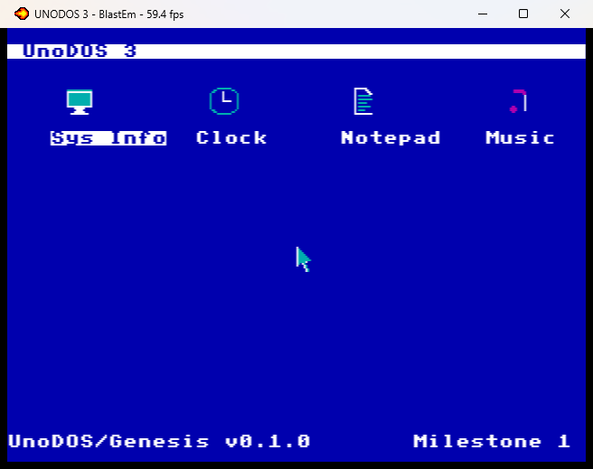

# UnoDOS/Genesis — Sega Mega Drive / Genesis port

Bare-metal UnoDOS 3 desktop for the Sega Mega Drive / Genesis (68000 @
7.67 MHz, VDP tile graphics, 64 KB work RAM), built from the same
portable design as the Amiga and Mac ports (`docs/PORT-SPEC.md`).

**Milestone 1 (2026-06-11):** desktop with icons, window manager
(drag, raise, close, z-order), pad-as-mouse with a hardware-sprite
cursor, on-screen soft keyboard, PS/2 keyboard/mouse drivers (wired
for real hardware), Notepad, and the Music test app (PSG Canon in D).
**Milestone 2 (2026-06-11):** the game ports — Dostris, OutLast and
Pac-Man (same tables/physics/AI as the x86 originals; Pac-Man's actors
are hardware sprites over the cell maze) with the shared game songs on
PSG channel 1, and a game-mode pad layout (a game topmost flips the
d-pad to arrow keys with hold-repeat, A = action, X = new game,
Y = pause).
**Milestones 4/4.5 (2026-06-11):** real storage — 8KB battery SRAM
with the USV1 mini-filesystem, a Files app, working Notepad F1-save,
and tape/WAV storage (KCS 1200-baud AFSK: the PSG writes through the
headphone jack, a one-comparator adapter reads; `mktape.py` makes the
PC the tape deck). Full architecture + the SD-card spec:
[docs/GENESIS-STORAGE.md](../docs/GENESIS-STORAGE.md).
**Milestones 3/5/6 (2026-06-12)** — full feature parity with the
Amiga port: the **Theme app** (the 8 shared preset palettes + 3-bit
RGB custom editing, applied by rewriting the themed CRAM entries),
the **Tracker** (the Amiga 32-row/4-channel pattern editor on the
PSG: three square channels + the noise channel, byte-identical
pattern format, saves to SRAM and tape), **Sega CD backup RAM**
(Mode-1 Sub-CPU boot + BIOS `_BURAM` stub behind a mailbox RPC; the
Files app grows a volume toggle), and the **cooperative scheduler**
(every window's app proc runs in its own task with a private 2KB
stack, ported from `amiga/scheduler.i`). Verified in BlastEm and **on real hardware (2026-06-12)** — the
cartridge boots and runs on a physical console.

## Display model

H40 (320×224 = 40×28 cells). Everything is composed on plane A as
(palette, tile) cells, so windows snap to the 8 px grid; the mouse
cursor is a hardware sprite and stays pixel-smooth. The four UI
attribute schemes (normal / inverted / accent / soft-key) are the four
VDP palette lines, each derived from the four UnoDOS theme colors —
the Theme app restyles the whole port by rewriting the themed CRAM
entries (the 8 shared presets, or per-channel 3-bit RGB editing).

## Controls (standard 3/6-button pad, port 1)

| Input | Action |
|---|---|
| D-pad | move the mouse cursor (accelerates while held) |
| A | click (hold to drag windows by their title bars) |
| B | show/hide the soft keyboard |
| C | Enter |
| Start | Esc (closes the topmost window) |
| X | Backspace |
| Y | Space |
| Z | hold for turbo cursor speed |

X/Y/Z need a 6-button pad; everything else works on a 3-button pad.
The soft keyboard covers the rest: full QWERTY, Shift (sticky), F1,
arrows, Esc — clicked keys post through the same event queue as a real
keyboard, with the same raw codes as the Amiga port, so apps are
byte-portable across the 68K family.

**Game mode:** while a game window is topmost the pad remaps — d-pad =
arrow keys (press + hold-repeat), A = Space (drop/action), B = soft
keyboard, C = Enter, Start = Esc (close), X = 'n' (new game),
Y = 'p' (pause). The cursor parks until a non-game window is topmost.

## PS/2 keyboard and mouse (real hardware only)

Per `docs/GENESIS-PORT.md`, PS/2 devices wire directly to the control
ports (passive adapter — the console supplies 5 V):

| DE-9 pin | MD signal | PS/2 signal |
|---|---|---|
| 1 | D0 ("Up") | DATA |
| 5 | +5V | +5V |
| 7 | TH | CLOCK |
| 8 | GND | GND |

- **Port 2 = keyboard**: TH raises the level-2 EXT interrupt on every
  clock edge; the handler assembles 11-bit frames and decodes scancode
  set 2 (shift, break and E0-extended codes handled).
- **Port 1 = mouse**: polled with PS/2 host-inhibit — CLK is held low
  except for a per-vblank receive window; 3-byte stream packets
  assemble across windows and decimate to the frame rate. At boot the
  kernel probes port 1 with `$F4` (enable reporting); if no ACK comes
  back it falls back to pad mode, so stock hardware just works.

Emulators do not model PS/2 devices on the control ports. The protocol
engines are injectable pure routines, so `./build.sh ps2` verifies the
whole decode path (bits → frames → scancodes/packets → events → apps)
in BlastEm; the physical wiring itself is a real-hardware test.

## Build

Needs vasm (`vasmm68k_mot`, the same binary as the Amiga port) and
Python 3. From this directory:

    ./build.sh            # build/unodos.gen (interactive)
    ./build.sh test       # AUTOTEST composite (notepad+music+soft kbd)
    ./build.sh notepad    # demo text + 6 up-arrows through notepad_key
    ./build.sh music      # Music app auto-started
    ./build.sh kbd        # soft keyboard clicks type "UNO" into Notepad
    ./build.sh ps2        # synthetic PS/2 streams through the decoders
    ./build.sh click      # double-click launch via the real click latch
    ./build.sh dostris    # new game + six hard-drops via dostris_key
    ./build.sh outlast    # driving + 60 forced physics steps
    ./build.sh pacman     # new game + 150 real AI steps
    ./build.sh sram       # F1-save -> wipe -> reopen from Files
    ./build.sh tape       # synthetic AFSK block through the decoder
    ./build.sh bram       # Sega CD BRAM round trip (fake transport)
    ./build.sh theme      # Theme app applies the Forest preset
    ./build.sh tracker    # Tracker demo song + playback

Tape WAV tooling (the PC is the tape deck):

    python mktape.py encode NOTES.TXT notes.wav   # play into the adapter
    python mktape.py decode recording.wav out.txt # decode a console save
    python mktape.py selftest

`mkdata.py` regenerates `gen_data.i` from the shared x86 assets: the
8×8 font as 4bpp tiles, window chrome tiles, the cursor sprite, the
app icons (pulled from the x86 `.BIN` headers), the Canon in D note
table (PSG values, 60 Hz duration ticks), and the PS/2 scancode maps.

The ROM is 64 KB, TMSS-safe, region "JUE". Run it with BlastEm (or any
accurate emulator), e.g.:

    blastem build/unodos.gen

Bring-up probes (also useful on real hardware): `-DPROBE_NOINT=1`
draws the splash with interrupts off, `-DPROBE_INT=1` renders the live
tick counter, `-DPROBE_WIN=1` opens Notepad statically, and
`-DPROBE_GUARD=1` traps out-of-range cell coordinates and freezes with
the caller PC + coordinates rendered in hex on the bottom row.

## Architecture notes

- All VDP access happens in main-loop context; ISRs only update state
  (PORT-SPEC §6). The vblank ISR acknowledges the interrupt with a VDP
  status read — safe because every control-port write in the kernel is
  a single atomic `move.l`.
- The vblank ISR reads the pad (standard TH-toggle sequence, 6-button
  aware), applies d-pad movement to the cursor state, and latches
  press-time click coordinates with a sequence counter; `handle_clicks`
  consumes the latch in the main loop (PORT-SPEC §3).
- Events: one 32-entry queue, `EV_KEY` data = (raw<<8)|ascii with the
  Amiga port's raw codes (arrows `$4C-$4F`, F1 `$50`).
- Variables live at `$FF8000`, addressed `offset(a4)` — the RAM
  edition of the Amiga port's `vars(pc)` convention.
- Storage: 8KB battery SRAM (USV1 mini-FS, Files app, Notepad F1),
  tape/WAV (KCS AFSK via the PSG + a comparator adapter), and Sega CD
  backup RAM via Mode 1 (`bram.i`: Sub-CPU BIOS boot + `_BURAM` stub,
  mailbox RPC, Word-RAM staging; the Files app's `v` key cycles the
  volume when a CD attachment is detected) — see
  [docs/GENESIS-STORAGE.md](../docs/GENESIS-STORAGE.md).
- Scheduler (`scheduler.i`): cooperative tasks over the window table —
  task 0 is the kernel (input, drag, audio services); each window's
  app proc runs in its own task with a private 2KB stack at $FF4000+
  and a one-slot mailbox (keys + frame ticks). Key posts yield-retry
  so input bursts survive the single-slot mailbox.
- The Sega CD probe arms a bus-error recovery: with no attachment,
  $400000+ reads are open bus on hardware but a 68000 bus error under
  BlastEm — the `berr` vector unwinds to the no-CD path instead of
  crashing the boot.

## Verified (BlastEm 0.6.2)

- boot → splash → desktop; icons render from the real x86 icon art
- window create/raise/close/drag, z-order, topmost-only refresh
- Notepad: typing, caret, line nav with goal column, vertical scroll
  clamp, status bar (`Ln 12 Co 14` after the six-up-arrow AUTOTEST)
- Music: PSG channel-0 sequencer playing Canon in D, staff view with
  the live note highlighted
- soft keyboard: hit-test → sticky shift → event queue → Notepad
  ("UNO" typed by the AUTOTEST)
- PS/2 decoders: "ps2 ok" typed via synthetic set-2 frames; a stream
  packet moves the cursor to the exact expected pixel
- click latch: synthesized double-click launches Music
- Dostris: hard drops settle, score/lines/level + next preview update
- OutLast: live road raster (curve, segment-striped grass, traffic),
  HUD counts speed/score/time down
- Pac-Man: maze + dots render, all four actor sprites roam, dots eaten
  raise the score, ghosts leave the house on their timers
- SRAM: F1-save → buffer wipe → reopen from the Files listing restores
  all 309 demo bytes
- tape: a synthetic AFSK block decodes through the real bit engine;
  mktape.py round-trips a 2047-byte file through a 44.1kHz WAV
- Sega CD BRAM: the same save/wipe/reopen round trip over the
  injectable RPC transport (name normalization, payload header,
  volume toggle) — the BIOS-trap path itself needs a CD-capable
  emulator (Genesis Plus GX / Ares) or real hardware
- Theme: preset apply recolors the whole desktop live (Forest in the
  AUTOTEST); the custom editor reads back the right channel values
- Tracker: the demo song renders in the pattern grid, the cursor and
  playback rows highlight, and playback drives the PSG through the
  task machinery
- scheduler: the soft-keyboard "UNO" burst, the PS/2 stream, and
  Dostris gravity all run through per-window tasks and mailboxes

**Real hardware: validated 2026-06-12 — the port runs on a physical
console.** Still to exercise (adapter hardware): PS/2 keyboard/mouse
wiring, the tape comparator, and the Sega CD Mode-1 path end-to-end
(sub BIOS decompress + BURAM against a real attachment).
