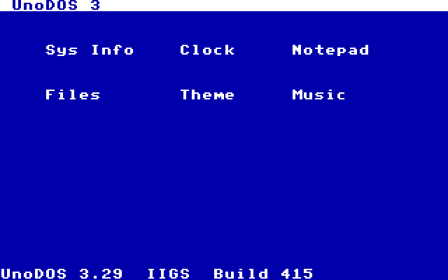
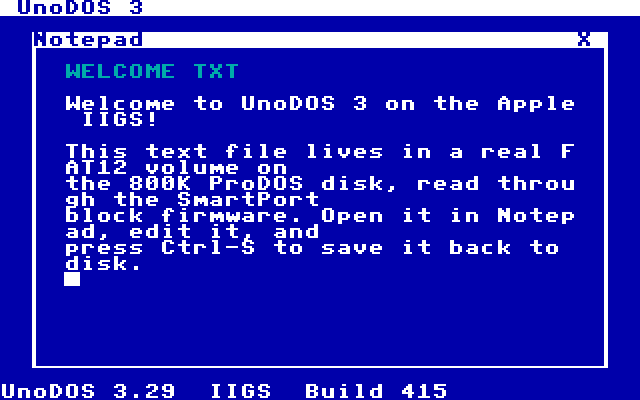
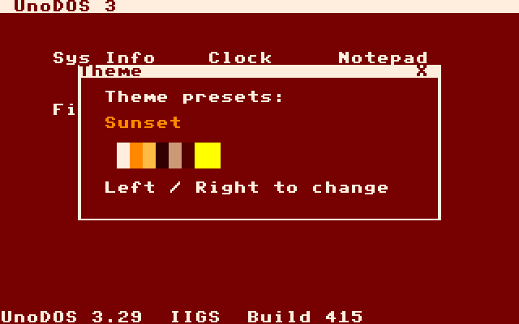

# UnoDOS 3 — Apple IIGS port

A native **65C816 / Super Hi-Res** port of UnoDOS 3 for the Apple IIGS,
taking advantage of the IIGS hardware the plain Apple II lacks: the 16-bit
65816 in native mode, the 320×200 16-colour (from 4096) SHR framebuffer,
ProDOS/SmartPort block firmware for storage, ADB mouse + keyboard, the
VGC vertical-blank tick, and (at M3) the Ensoniq DOC sound chip.

## Status

| Milestone | Scope | State |
|-----------|-------|-------|
| M0 | Toolchain, ProDOS block-boot, SHR splash, ROM-free harness | ✅ shipped |
| M1 | SHR desktop + window manager + ADB mouse/keyboard + SysInfo/Clock | ✅ shipped |
| M2 | Storage: SmartPort block I/O + FAT12 + Files/Notepad (persistent) | ✅ shipped |
| **M3** | 4096-colour Theme + Ensoniq DOC audio (Music) | ✅ shipped (build 415) |
| M3+ | Colour games (Dostris/Pac-Man/OutLast/Paint) + Tracker + scheduler | planned |





## What M3 delivers

* **4096-colour theming.** The Theme app cycles the 8 shared UI presets,
  each a single write to SHR palette line 0 that recolours the *entire*
  desktop instantly — the Super Hi-Res palette is looked up per pixel at
  scan-out, so no pixels are redrawn.
* **Ensoniq DOC audio.** The marquee IIGS sound chip — 32 oscillators and
  64 KB of dedicated sound RAM — driven through the sound GLU. Music loads a
  wavetable into DOC RAM and sequences a melody on an oscillator. (Sound
  isn't reproducible in the ROM-free harness, but every DOC register write
  is logged and asserted.)

## What M2 delivers

* **FAT12 over SmartPort.** A real, PC-interchangeable FAT12 volume on the
  800 KB disk, read and written through the slot firmware's ProDOS block
  driver (called in 6502 emulation mode from the native kernel).
* **Files + Notepad.** Files lists the root directory; opening a file loads
  it into Notepad (single- and multi-cluster reads). Notepad edits the text
  and **Ctrl-S writes it back to disk** — verified to persist across a full
  reboot of the disk image.

## What M1 delivers

* **A real colour desktop.** Menu bar, an icon grid, and the version/build
  line, all in 16-colour Super Hi-Res, drawn by a 4bpp text/rect engine
  that expands the shared UnoDOS 8×8 font (`NEWVIDEO ($C029)=$C1`).
* **A full window manager.** The PORT-SPEC §2 contract — a 16-window table
  (6 live), z-order with raise-on-click, title-bar drag, and a close box —
  ported from the proven SNES expression onto cell coordinates (8×8 cells,
  40×25 on 320×200).
* **A real pointer + keyboard.** A polled ADB mouse drives a save-under
  software cursor (no hardware sprite on SHR); the `$C000`/`$C010` keyboard
  latch feeds the event queue. Icons launch by double-click or by
  arrow-keys + Return; ESC closes the topmost window.
* **SysInfo + Clock.** Machine identity and a live `HH:MM:SS` uptime clock
  that ticks once a second.
* **Built on the M0 foundation** — the same ProDOS block-boot chain
  (firmware loads block 0 → kernel to `$00:2000` → native mode) and the
  ROM-free `cpu65816.py` + `harness.py` rig, now with a frame-stepping
  script runner that injects keys and mouse input and renders SHR → PNG.

## Build

```sh
cd iigs
./build.sh            # -> build/unodos_iigs.po  +  build/m1.png
```

Requires cc65 (`ca65`/`ld65`) and Python 3. The script regenerates the
font/palette from the shared assets, assembles `boot.s` and `kernel.s`,
packs the 800 KB ProDOS image, and renders the desktop through the harness.

## Test

```sh
python cpu65816.py        # CPU core self-test  -> SELFTEST OK
python tests/m1.py        # M1 regression       -> M1 PASS
python tests/m2.py        # M2 regression       -> M2 PASS
python tests/m3.py        # M3 regression       -> M3 PASS
```

## Running it for real

* **Emulator (by hand):** GSplus, KEGS, or MAME `apple2gs` — all need a
  IIGS ROM image you supply. Boot `build/unodos_iigs.po` as a 3.5" disk.
* **Real hardware:** FloppyEmu in **SmartPort (3.5″) mode** — UnoDOS/IIGS
  is an 800 KB ProDOS-order image, the opposite of the 140 KB 5.25″ Apple
  II port.

## Layout

| File | Role |
|------|------|
| `boot.s` | block-0 ProDOS boot stage (loads the kernel, goes native, jumps) |
| `kernel.s` | the kernel — SHR desktop, window manager, input, apps |
| `fs.i` | FAT12 storage over SmartPort (`blk_io` + the FAT12 core) |
| `apps.i` | the Files + Notepad apps |
| `theme.i` | the Theme app + the 8 palette presets |
| `snd.i` | the Ensoniq DOC sound engine + the Music app |
| `mkdata.py` → `gen_data.inc` | shared 8×8 font + SHR UI palette |
| `mkdsk.py` / `mkfs.py` | pack the 800 KB ProDOS image / write its FAT12 volume |
| `boot.cfg` / `kernel.cfg` | ld65 link configs |
| `cpu65816.py` | the 65C816 interpreter (reusable; self-testing) |
| `harness.py` | ROM-free firmware shim + script runner + SHR→PNG renderer |
| `tests/m1.py`, `tests/m2.py`, `tests/m3.py` | headless regressions |

See `HANDOFF.md` for the verified boot contract and the M1–M3 plan.
