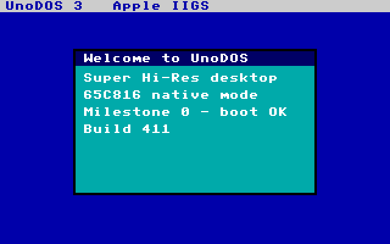

# UnoDOS 3 — Apple IIGS port

A native **65C816 / Super Hi-Res** port of UnoDOS 3 for the Apple IIGS,
taking advantage of the IIGS hardware the plain Apple II lacks: the 16-bit
65816 in native mode, the 320×200 16-colour (from 4096) SHR framebuffer,
ProDOS/SmartPort block firmware for storage, ADB mouse + keyboard, the
VGC vertical-blank tick, and (at M3) the Ensoniq DOC sound chip.

## Status

| Milestone | Scope | State |
|-----------|-------|-------|
| **M0** | Toolchain, ProDOS block-boot, SHR splash, ROM-free harness | ✅ shipped (build 411) |
| M1 | SHR desktop + window manager + ADB mouse/keyboard + SysInfo/Clock | planned |
| M2 | Storage: SmartPort block I/O + FAT12 + Files/Notepad + disk apps | planned |
| M3 | Parity: colour apps + Ensoniq DOC audio + scheduler | planned |



## What M0 proves

* **65816 native mode.** The boot stage enters in 6502 emulation mode and
  switches to native 16-bit (`clc/xce`, `rep #$30`) before launching the
  kernel.
* **Super Hi-Res, in colour.** 320×200, 16 colours/line from a 4096-colour
  space, 4 bits/pixel. The kernel enables SHR via `NEWVIDEO ($C029)=$C1`
  and renders a desktop, a menu bar, and a framed window with a 4bpp text
  engine that expands the shared UnoDOS 8×8 font.
* **ProDOS/SmartPort boot chain.** Firmware loads block 0 to `$0800` and
  enters at `$0801`; our stage finds the slot's ProDOS block driver
  (`$Cn00+[$CnFF]`) and reads the kernel from blocks 1..K to `$00:2000`.
  No GCR hand-rolling — the firmware *is* the disk driver (the IIGS
  ".Sony equivalent").
* **A ROM-free, CI-able harness.** `cpu65816.py` is a from-scratch 65C816
  interpreter; `harness.py` plays the firmware around it (block autoload,
  the ProDOS driver via a WDM trap, the `$C0xx` soft-switch page) and
  renders SHR → PNG. No emulator install and no IIGS ROM required.

## Build

```sh
cd iigs
./build.sh            # -> build/unodos_iigs.po  +  build/m0.png
```

Requires cc65 (`ca65`/`ld65`) and Python 3. The script regenerates the
font/palette from the shared assets, assembles `boot.s` and `kernel.s`,
packs the 800 KB ProDOS image, and renders the splash through the harness.

## Test

```sh
python cpu65816.py        # CPU core self-test  -> SELFTEST OK
python tests/m0.py        # M0 regression       -> M0 PASS
```

## Running it for real

* **Emulator (by hand):** GSplus, KEGS, or MAME `apple2gs` — all need a
  IIGS ROM image you supply. Boot `build/unodos_iigs.po` as a 3.5" disk.
* **Real hardware:** FloppyEmu in **SmartPort (3.5″) mode** — UnoDOS/IIGS
  is an 800 KB ProDOS-order image, the opposite of the 140 KB 5.25″ Apple
  II port.

## Layout

| File | Role |
|------|------|
| `boot.s` | block-0 ProDOS boot stage (loads the kernel, goes native, jumps) |
| `kernel.s` | M0 kernel — enables SHR and paints the splash |
| `mkdata.py` → `gen_data.inc` | shared 8×8 font + SHR UI palette |
| `mkdsk.py` | pack the 800 KB ProDOS image (patches the block count into boot) |
| `boot.cfg` / `kernel.cfg` | ld65 link configs |
| `cpu65816.py` | the 65C816 interpreter (reusable; self-testing) |
| `harness.py` | ROM-free firmware shim + SHR→PNG renderer |
| `tests/m0.py` | headless M0 regression |

See `HANDOFF.md` for the verified boot contract and the M1–M3 plan.
