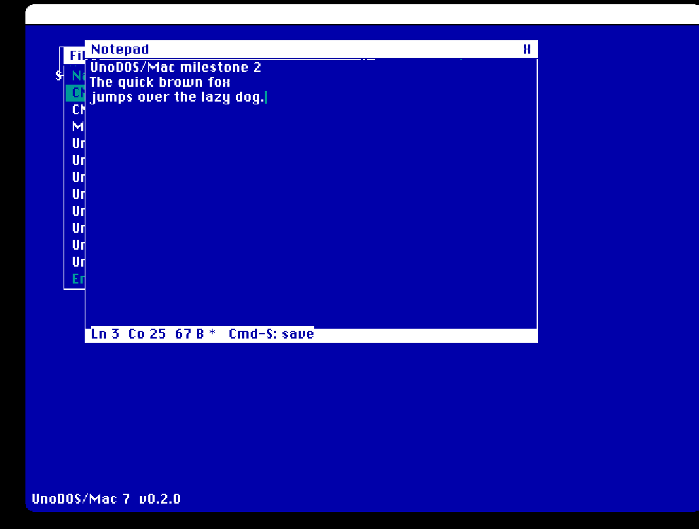
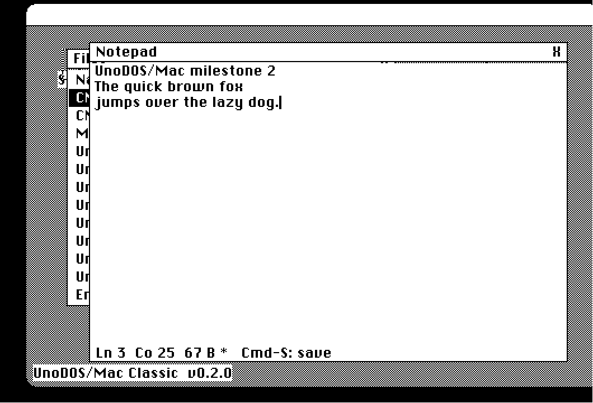

# UnoDOS/Mac — hosted classic Mac OS ports (milestone 3)

> **Note (2026-06-12):** these are the *hosted* Mac variants — UnoDOS
> running as a Toolbox application on top of classic Mac OS. The Mac
> port as a **real operating system** (ROM-bootstrapped, own kernel,
> drivers and API — no Mac OS underneath) lives in
> [macplus/](../macplus/).

Two Macintosh ports of the UnoDOS desktop, from **one C codebase**
(`unodos.c`), built with the [Retro68](https://github.com/autc04/Retro68)
toolchain and verified running under the ROM-free
[Executor](https://github.com/autc04/executor) emulator:

| App | Era | Hardware | Graphics |
|---|---|---|---|
| **UnoDOS7** | System 7 | Mac II / LC / Quadra (68020+) | **Color QuickDraw**, full UnoDOS palette |
| **UnoDOSClassic** | System 1–6 | Mac Plus / SE / Classic (68000) | classic 1-bit QuickDraw, authentic black-on-white |

### System 7, color (UnoDOS7)


### System 1–6, monochrome (UnoDOSClassic)


Both screenshots are the `test` builds (apps auto-launched) running under
Executor: **Notepad** topmost with demo text, a visible caret, and the live
`Ln/Co/bytes` status bar; the **Files** directory listing stacked behind
(real File Manager contents); **Music** playing Canon in D underneath. The
color build renders the literal UnoDOS palette; the mono build is the
canonical 1-bit Mac look.

## Apps

Eleven apps from one codebase (the color-only **Theme** app makes it
eleven on UnoDOS7, ten icons on UnoDOSClassic):

- **Sys Info**, **Clock** — system panels.
- **Files**, **Notepad**, **Music** — the milestone-2 trio (below).
- **Theme** (color targets) — the 8 preset palettes shared with the x86
  and Amiga ports, plus per-channel custom RGB editing of the UI colors.
- **Dostris** — port of `apps/tetris.asm`: same piece tables, scoring
  and speed curve; the seven VGA piece colors with bevel highlights at
  16 px cells; Korobeiniki through the Sound Manager.
- **OutLast** — port of `apps/outlast.asm`: same track, perspective,
  traffic and physics; full `outlastv`-style scenery in a 480×300
  playfield (gameplay math stays in the faithful 320×200 virtual space,
  rendered at 3/2); Sunset Drive music.
- **Pac-Man** — port of `apps/pacman.asm`: full 28×25 maze, three-ghost
  AI (Blinky red, Pinky pink, Clyde orange), scatter/chase schedule,
  frightened mode with the 200→1600 chain.
- **Tracker** — the shared 32-row × 4-channel pattern editor
  (byte-identical SONG.TRK format) on up to four Sound Manager
  square-wave channels; the noise column plays a low thump. s/l save
  and load through the File Manager.
- **Paint** — the MacPaint-style editor: tool palette (pencil, brush,
  eraser, line, rect, filled rect, oval, filled oval, flood fill,
  spray), drag drawing with rubber-band shapes, white canvas with a
  byte-per-pixel backing store. Color selector: the full 8-bit gamut
  (a 256-swatch picker) on UnoDOS7; authentic 1-bit dither patterns
  on UnoDOSClassic. PAINT.UNO save/load.

A platform-themed splash (a happy compact Mac + "UnoDOS 3") shows on
boot on both targets.

On the color targets, game art draws in **true RGB** through 8-bit
Color QuickDraw (`fill_rgb`, nearest of the 256 system colors); each
color carries a 4-slot fallback so the mono target keeps its authentic
1-bit look.

## Milestone 2 — the app trio

- **Files** — volume directory listing via `PBGetCatInfo` (name + size,
  `<DIR>` markers), arrow-key/click selection with a themed selection bar,
  scrolling, `R` refresh. Enter or double-click opens the file in Notepad.
- **Notepad** — text editor: caret, insert/backspace/return, arrow-key
  navigation (incl. up/down with column memory), vertical scrolling, and
  the **live status bar** (`Ln 3  Co 25  67 B *`) that updates on every
  keystroke — the x86 audit's stale-status fix is law here. `Cmd-S` saves
  through the File Manager (create/write/flush); files opened from Files
  keep their name, new text saves as `UNTITLED.TXT`.
- **Music** — the same Canon in D arrangement as `apps/music.asm`, played
  on the Sound Manager square-wave synth (`noteSynth`/`noteCmd`), with a
  staff view, per-note playback highlight, and Space to play/stop. If the
  Sound Manager is unavailable the app runs visual-only.

## Milestone 3 — multitasking + PC floppies (2026-06-12)

- **Cooperative scheduler**: every window's app proc runs in its own
  task with a private heap stack and a one-slot event mailbox — the
  same model as the Amiga/Genesis schedulers. The context switch is
  ~6 lines of 68K asm (callee-saved `movem` + SP swap); `StkLowPt`
  is cleared so the classic stack sniffer accepts the task stacks
  (the Thread Manager's own convention). Keys post with a bounded
  yield-retry so typing bursts survive the single mailbox slot.
- **PC-compatible floppies (FAT12 read/write)**: a portable FAT12
  core in C over an injectable 512-byte block device. The Files app
  cycles volumes with `V` (HFS ↔ PC disk); opening a FAT file loads
  it into Notepad and Cmd-S writes it back to the volume it came
  from. The real device is raw `.Sony` driver sector access; under
  Executor (no floppy emulation) a RAM-backed FAT12 image stands in
  so the whole stack stays emulator-testable. PC interchange is
  verified by `mac/test_fat12.py`, which compiles the same core
  host-side, writes an image through it, and re-reads it with an
  independent FAT12 parser byte-for-byte.

**Booting vs. reading PC disks**: the Mac targets are Toolbox
*applications*, not a bootable OS — the machine boots classic Mac OS
from an HFS volume (Macs cannot boot from FAT media at all), and
UnoDOS launches as an app. PC floppies are **data volumes only**,
mounted from inside the running app via Files → `V`. Hardware note:
only SuperDrive (FDHD) machines can physically read 1.44 MB MFM PC
disks; the 800K GCR-only drives in the Mac Plus and early SE cannot,
regardless of software.

## Strategy

Per `docs/PORT-SPEC.md` and the Toolbox-based plan in
`docs/M68K-PORT-FEASIBILITY.md`: UnoDOS owns **one full-screen GrafPort**
and runs its **own** window manager, widgets, and theme inside it. The ROM
Toolbox supplies the screen, the Event Manager (mouse + keyboard, already
press-time stamped — PORT-SPEC §3 for free), QuickDraw / Color QuickDraw
primitives, and `TickCount`. The window manager, event routing, desktop,
and the SysInfo/Clock apps are the same model as the x86 and Amiga ports.

The **only** difference between the two apps is the theme layer
(`#if UNO_COLOR`): Color QuickDraw `RGBForeColor`/`PaintRect` vs. classic
1-bit patterns. Everything else — the WM, z-order, drag with clamping,
click-to-raise, the press-time click latch, the apps — is shared. System
1–6 had no Color QuickDraw, so the mono build avoids those calls entirely
and targets the 68000.

## Build

Needs the Retro68 toolchain (a GCC cross-compiler for classic Mac):

```sh
# one-time: build Retro68 (Linux/macOS/WSL). ~30-45 min.
git clone --recursive https://github.com/autc04/Retro68.git
mkdir Retro68-build && cd Retro68-build
../Retro68/build-toolchain.bash --no-ppc --no-carbon

# build both apps
cd unodos/mac
R68=/path/to/Retro68-build ./build.sh
```

`build.sh` produces, for each app, a `.bin` (MacBinary), `.APPL`
(application), and `.dsk` (bootable 800K HFS disk image) in `build/`.

## Run

Under **Executor** (ROM-free, reimplements the Toolbox — no Mac ROM or
System install needed):

```sh
EXEC=/path/to/executor ./run.sh color      # UnoDOS7
EXEC=/path/to/executor ./run.sh mono        # UnoDOSClassic
./run.sh color test                          # auto-launch the apps
```

Point Executor at the **`.APPL`**, not the `.dsk` — the `.APPL`
auto-launches our app, while the `.dsk` opens Executor's Browser (and
trips a PBClose hang on the color disk). For the GUI window you need a
display (WSLg, X, or Wayland).

On **real hardware** or a ROM-based emulator (Mini vMac for mono, Basilisk
II for color — both need a user-supplied Mac ROM and System), copy the
`.bin` over and it runs as a normal application.

## Architecture — apps load from storage at runtime

The kernel is **app-free**.  `unodos.c` contains the theme layer, window
manager, event/desktop logic, renderer, FAT12, audio and the *generic*,
pointer-based loader (`app_loader.c`) — and **zero app UI code**.  Each of
the 11 apps (`apps/<name>.c`, shared verbatim with the PS2/DC ports) is
compiled into a **separate, position-independent flat code resource**
(`-Wl,--mac-flat`, linker entry `uno_app_main_entry`) and stored in the
application's resource fork as a private **`'Uapp'` code resource**
(ids 1000–1010).  Nothing app-specific is linked into the kernel binary.

At runtime the platform hook `uno_load_module(proc)` in `mac_modload.c`
brings an app in **on demand** through the Resource Manager:

```c
Handle h = GetResource('Uapp', 1000 + proc);   /* read from storage   */
MoveHHi(h); HLock(h);                            /* pin it in the heap  */
UnoAppEntry entry = (UnoAppEntry) *h;            /* the flat blob       */
const AppInterface *ai = entry(&gKApi);          /* app self-relocates, */
                                                 /* stashes the kernel  */
                                                 /* API, returns vtable */
```

The flat blob's entry stub calls `RETRO68_RELOCATE()` (libretro) to fix up
its own globals before it touches anything — it is loaded at an address
unknown at link time.  It then receives the `KernelApi` callback table,
stashes it, and returns its `AppInterface` (a vtable of
draw/key/click/tick/opened/closed); the window manager dispatches purely
through those pointers, with **no `switch(proc)` on app identity** anywhere
in the kernel.  Toolbox calls inside an app are inline A-traps (no linkage
needed); the small libc tail (`strcpy`/`memcpy`/…) is statically linked
into each blob.

This is genuine runtime code loading: `nm` on either shipping kernel object
(`UnoDOS7`/`UnoDOSClassic`) shows **zero app draw symbols** and only an
undefined reference to `uno_load_module`, and the `.APPL` resource fork
holds exactly 11 `'Uapp'` resources (verify with the resource-map dump in
`build.sh` output, or `DeRez`).  A `'Uapp'` type (not `'CODE'`) is used so
the Segment Loader never auto-loads them — they are demand-loaded code
resources owned by the kernel.

`CMakeLists.txt` builds the 11 app blobs per colour/mono variant
(`uno_build_app_resources`), generates the Rez `.r` that `$$read`s each
freshly-linked blob into a `'Uapp'` resource, and links the app-free
kernel (`uno_app_target`).  It also emits `*Test` variants that
auto-launch apps for screenshot verification without host→guest input
injection: `UnoDOS7Test`/`UnoDOSClassicTest` (Music+Files+Notepad),
`UnoDOS7FTest` (Files), `UnoDOS7ThTest` (Theme),
`UnoDOS7SpTest`/`UnoDOSClassicSpTest` (long-hold splash),
`UnoDOS7DtTest`/`UnoDOS7OlTest`/`UnoDOS7PmTest` (the games at boot).

### Executor capture (headless WSL)

`shots/runshot.sh <APP> <name>` stages an `.APPL` under a native path
(Executor SIGABRTs walking `/mnt/c`), runs it under Executor on the WSLg
`:0` display, grabs the `executor` content window with `import`, and the
caller crops it `640x480+0+0` to the Mac screen.  Captures under `shots/`:
`mac_native_desktop.png` (11-icon desktop) and the loaded-from-resource
apps `mac_native_pacman.png`, `mac_native_dostris.png`,
`mac_native_files.png`, `mac_native_apps.png` (Notepad+Music+Files),
`mac_native_theme.png`.

## Known limitations (milestone 3)

- Notepad: no horizontal scroll (long lines clip), 4 KB buffer, no
  find/replace; Files: 24-entry listing cap (16 on the PC volume).
- The FAT12 `.Sony` raw-sector path is real-hardware-only (Executor
  has no floppy); the RAM-image fallback covers the logic in CI.
- Tracker polyphony depends on the Sound Manager mixing multiple
  square-wave channels (System 6.0.7+/real hardware; Executor may
  voice fewer).
- Native runtime app-loading is Executor-verified: the desktop and the
  apps (Pac-Man, Dostris, Files, Notepad/Music, Theme) were captured
  loading from their `'Uapp'` code resources at runtime (`shots/`).  The
  capture rig runs Executor on the WSLg `:0` display and grabs the
  `executor` content window (the Qt build does not expose a 640×480 X11
  window, and bare-Xvfb root capture is black, so window-level grab on
  `:0` is the path — see `shots/runshot.sh`).
- Executor quirk: TickCount() advances much faster than 60 Hz, so the
  ~2s splash hold races by under Executor; timing is correct on real
  hardware. UnoDOS7SpTest holds long for screenshot runs.
- Uses our own full-screen GrafPort and chrome rather than real Mac
  windows — intentional (PORT-SPEC: one GrafPort, our WM), so the look is
  identical across color/mono and matches the other ports.
- Drawing uses QuickDraw primitives directly; no offscreen GWorld
  double-buffering yet (the topmost-only repaint keeps flicker low).
