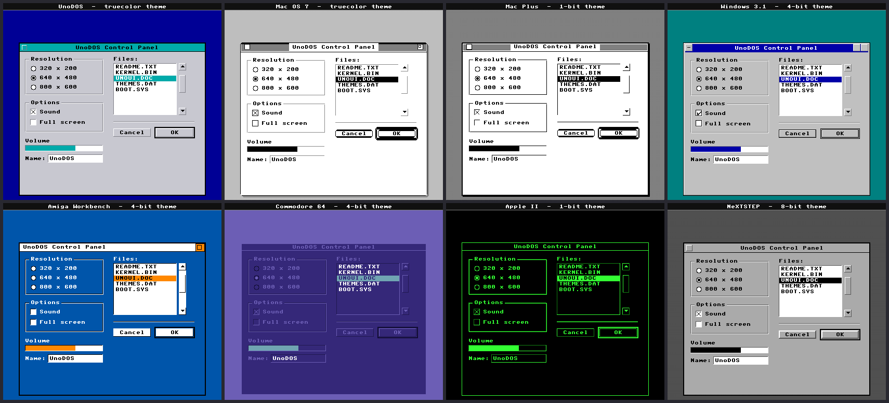
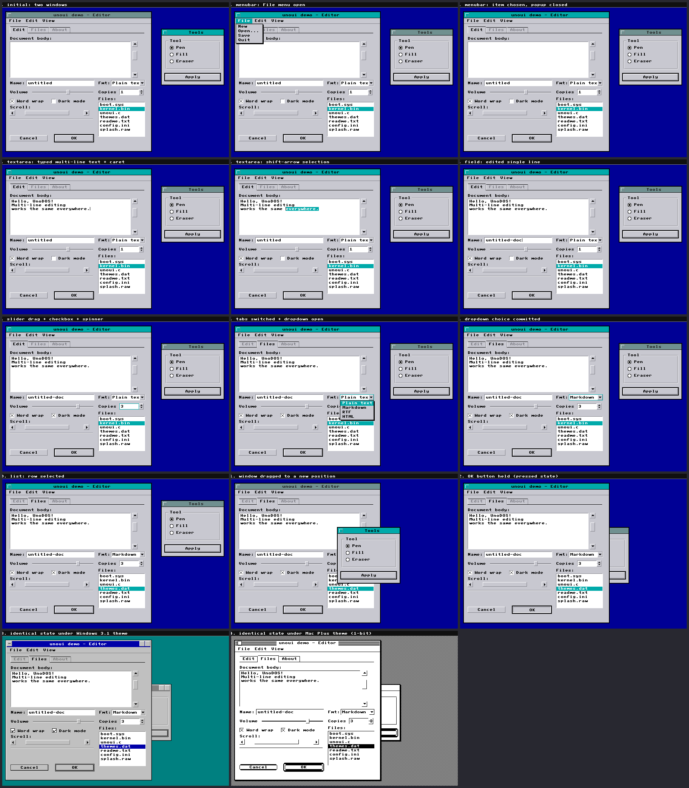

# unoui — the UnoDOS cross-platform UI toolkit

Write an app's window UI **once**; render it on every UnoDOS platform with a
unified look — or drop in a per-platform **theme** to make it look native.

This is the [`uno3d`](../uno3d/README.md) pattern applied to look-and-feel: a
portable C core over the shared `fb.h` software framebuffer (so it builds on
every C port — PS2, Dreamcast, … — and the host), plus a swappable vtable.
`uno3d` swaps the rasteriser **backend**; `unoui` swaps the **theme**.

```
   ┌─ app (write once) ────────────┐      ┌─ theme (swap freely) ───────────┐
   │ unoui_window_init(...)        │      │ palette  – semantic colours      │
   │ unoui_add_button(...)         │ ───▶ │ metrics  – sizes, depth, radius  │
   │ unoui_add_list(...)           │      │ draw     – chrome painters (NULL │
   │ ...                           │      │            entries fall back to  │
   └───────────────────────────────┘      │            the portable default) │
              unoui_render(&win, theme)    └──────────────────────────────────┘
```

## The proof

`./build.sh` builds the core + all themes + one demo window and renders that
**single window tree** under eight themes into `build/themes.png`:



Every panel is the *same* `demo_build()` from `unoui_demo.c` — only the theme
pointer passed to `unoui_render()` changes.

## A theme is three things

1. **`unoui_palette`** — semantic colour *roles* (`title_bg`, `button_face`,
   `bevel light/shadow`, `accent`…), never literal colours. Swap the struct and
   every widget recolours. *(palette theming — see `theme_c64.c`, a whole C64
   identity from colours alone, zero graphics code.)*
2. **`unoui_metrics`** — sizes (title height, bevel thickness, corner radius,
   drop shadow) and the target colour **depth** (`FULL/8/4/1`-bit).
3. **`unoui_draw`** — a vtable of chrome painters. Leave any entry `NULL` and the
   portable default is used; override one and that widget gets entirely custom
   **graphics**. *(graphics theming — see `theme_macplus.c`'s racing-stripe
   title bar, `theme_win31.c`'s double-bevel buttons + caption box.)*

Adding a theme = one new file defining `const unoui_theme theme_<name>` and an
`extern` in `unoui_theme.h`. No core or app edits — same contract as a uno3d
backend.

## Bit depth & resolution

Themes declare a target `depth`. Shaded fills route through `ui_shade()`, which
becomes a smooth interpolated colour at full depth and an **ordered-dither
stipple** at 1-bit — so the write-once chrome renders correctly on a 1-bit Mac
Plus *and* a 32-bit PS2. The Mac Plus theme's iconic 50% grey desktop and the
4-bit themes' dithered mid-tones all come out of the same call. Geometry is
derived from each window's rect and the theme's metrics, so any resolution works
(640×448 PS2, 640×480 Dreamcast, …).

## Files

| file | role |
|------|------|
| `unoui.h` / `unoui.c` | public API + portable core: window/widget building, depth-aware drawing helpers (`ui_shade`, `ui_stipple`, `ui_bevel`, `ui_round_*`), editable-text engine, the **default painters**, and the render dispatcher with per-painter NULL fallback |
| `unoui_input.c` | the interaction layer: event dispatch, hit-testing, focus + Tab, drag, popups, multi-line text editing — **zero platform code** |
| `unoui_theme.h` | the theme model: palette + metrics + draw vtable, helper decls, theme externs |
| `themes/theme_*.c` | the eight shipped themes (see below) |
| `unoui_demo.c` | the static write-once demo window (theme contact sheet) |
| `unoui_app.c` | the interactive write-once app (all widgets, two windows) |
| `host_unoui.c` | host harness: render every theme → one PPM each |
| `host_unoui_input.c` | host harness: drive the app with a scripted event stream → storyboard |
| `tools/tile.py` | tile renders into a contact sheet (stdlib only) |
| `build.sh` | build + render + contact sheet (`themes.png`) + storyboard (`storyboard.png`) |

## Shipped themes

| theme | depth | what it exercises |
|-------|-------|-------------------|
| `theme_unodos`  | full  | the unified house look — **palette only**, all-default painters |
| `theme_macos7`  | full  | rounded white windows, pinstripe title, close/zoom boxes, rounded default ring |
| `theme_macplus` | 1-bit | strict B&W — the dither/stipple path, racing-stripe title, drop shadow |
| `theme_win31`   | 4-bit | grey 3D — blue caption bar with control/min/max boxes, double-bevel buttons |
| `theme_amiga`   | 4-bit | Workbench 1.x — palette + a small title-bar override (depth gadget) |
| `theme_c64`     | 4-bit | two-blue VIC screen — **palette only** |
| `theme_apple2`  | 1-bit | green-phosphor mono — **palette only** |
| `theme_next`    | 8-bit | NeXTSTEP chiselled greyscale — palette + wider bevel metric |

## Widgets

Window (frame + title bar + close/zoom/caption chrome), menu bar (with popup
menus), label, push button (default/pressed/disabled), checkbox, radio, **single-
line edit field** and **multi-line text area** (caret, selection, scrolling),
progress bar, vertical + horizontal scrollbars, slider, numeric spinner,
dropdown/combo (with popup), tab strip, list box (with selection), group box,
separator, and a desktop icon. All states drawn from `UI_F_*` flags.

## Interactivity — write once, behaves the same everywhere

The toolkit's behaviour is **a pure function of an abstract event stream**
(`unoui_event`). A port writes ONE small adapter mapping its native
mouse/keyboard to `unoui_event` and calls `unoui_handle()`; the result is
byte-identical on every platform. That adapter plus the `fb` hookup is the only
per-platform code an app needs.

```c
unoui_ui_init(&ui, &theme_unodos, FB_W, FB_H);
unoui_ui_add(&ui, &window);
for (;;) {
    unoui_event ev = port_next_event();      /* <-- the only platform code   */
    unoui_action a = unoui_handle(&ui, &ev); /* portable behaviour            */
    if (a.changed && a.id == ID_OK) save();
    unoui_render_ui(&ui);                     /* desktop + windows + popups    */
    port_present(fb);                         /* <-- the only platform code   */
}
```

Handled uniformly across platforms: mouse hover/click/drag, **window move with
z-order**, scrollbar/slider thumb drag, list & tab selection, menu and dropdown
popups, focus + **Tab traversal**, keyboard activation, and **full multi-line
text editing** — caret, mouse caret-placement and drag-select, Shift-arrow
selection, Home/End, Backspace/Delete, word-wrap-free scrolling. `unoui_input.c`
contains zero platform code.

`./build.sh` also drives the write-once app with a *scripted* event stream and
snapshots the resulting states into `build/storyboard.png` — exactly what any
port would produce from the same gestures. The last two frames re-skin the
identical live state under other themes, proving input and theming compose:



## Build

```sh
./build.sh          # → build/themes.png + per-theme PNGs
```

Reuses the shared software framebuffer (`../ps2/fb.c`) and its 8×8 font, exactly
as the `uno3d` host target does. On a real port, the same `unoui.c` + `themes/`
compile in and the port's glue calls `unoui_render()` against its own `fb`.
